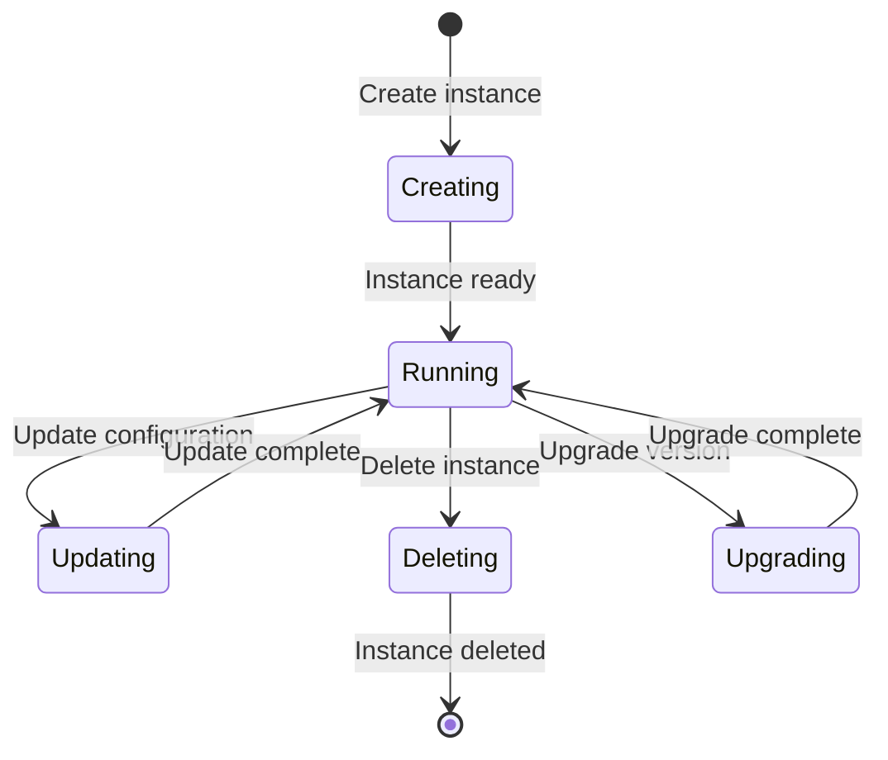

# Data Model: Kafka Instance

## Entity: KafkaInstance

Represents an Alibaba Cloud Kafka instance.

### Fields

| Field | Type | Required | Description |
|-------|------|----------|-------------|
| instance_id | string | Yes (computed) | Unique identifier for the Kafka instance |
| name | string | No | Name of the Kafka instance |
| disk_type | int | Yes | Disk type for the instance (valid values: 0, 1) |
| disk_size | int | Yes | Disk size in GB |
| deploy_type | int | Yes | Deployment type (valid values: 4, 5) |
| partition_num | int | No | Number of partitions |
| topic_quota | int | No | Topic quota (deprecated) |
| io_max | int | No | Maximum I/O operations per second |
| io_max_spec | string | No | I/O specification |
| paid_type | string | No | Payment type (PrePaid or PostPaid) |
| spec_type | string | No | Specification type |
| eip_max | int | No | Maximum EIP connections |
| resource_group_id | string | No | Resource group ID |
| security_group | string | No | Security group ID |
| service_version | string | No | Service version |
| config | string | No | Instance configuration (JSON format) |
| kms_key_id | string | No | KMS key ID for encryption |
| vpc_id | string | No (computed) | VPC ID |
| vswitch_id | string | Yes | VSwitch ID |
| zone_id | string | No (computed) | Zone ID |
| enable_auto_group | bool | No | Enable auto group creation |
| enable_auto_topic | string | No | Enable auto topic creation ("enable" or "disable") |
| default_topic_partition_num | int | No | Default topic partition number |
| vswitch_ids | []string | No | List of VSwitch IDs |
| selected_zones | string | No | Selected zones configuration (JSON) |
| cross_zone | bool | No | Cross-zone deployment |

### Computed Fields

| Field | Type | Description |
|-------|------|-------------|
| end_point | string | Endpoint for the instance |
| ssl_endpoint | string | SSL endpoint for the instance |
| domain_endpoint | string | Domain endpoint for the instance |
| ssl_domain_endpoint | string | SSL domain endpoint for the instance |
| sasl_domain_endpoint | string | SASL domain endpoint for the instance |
| topic_num_of_buy | int | Number of topics purchased |
| topic_used | int | Number of topics used |
| topic_left | int | Number of topics remaining |
| partition_used | int | Number of partitions used |
| partition_left | int | Number of partitions remaining |
| group_used | int | Number of consumer groups used |
| group_left | int | Number of consumer groups remaining |
| is_partition_buy | int | Whether partitions are purchased |
| status | int | Current status of the instance |
| paid_type | string | Payment type (computed) |

### Relationships

- Belongs to: VPC (via vpc_id)
- Belongs to: VSwitch (via vswitch_id)
- Belongs to: Security Group (via security_group)
- Belongs to: Resource Group (via resource_group_id)
- Has many: Topics
- Has many: Consumer Groups
- Has many: SASL Users
- Has many: SASL ACLs

### Validation Rules

1. `disk_type` must be 0 or 1
2. `deploy_type` must be 4 or 5
3. Either `io_max` or `io_max_spec` must be specified, but not both
4. `paid_type` must be "PrePaid" or "PostPaid"
5. `enable_auto_topic` must be "enable" or "disable"
6. `name` must be between 3 and 64 characters
7. `config` must be valid JSON if specified

### State Transitions

### ID Encoding

Kafka instance IDs are encoded as simple strings without additional encoding since they are provided directly by the Alibaba Cloud API.