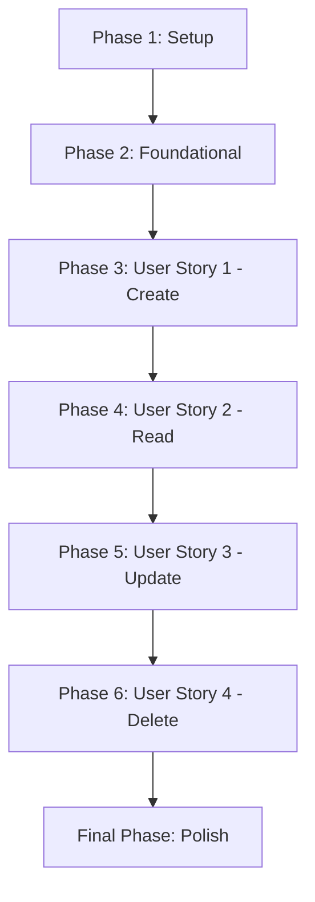

# Task List: Refactor Kafka Instance API

**Feature**: Refactor Kafka Instance API | **Branch**: `003-refactor-kafka-instance` | **Generated**: 2025-11-21

## Implementation Strategy

This feature will be implemented using an incremental delivery approach, with each user story representing a complete, independently testable increment. The implementation will follow the architecture guidelines (Resource → Service → API) and maintain backward compatibility with existing functionality.

### MVP Scope
The Minimum Viable Product consists of User Story 1 (Create Kafka Instance) and User Story 2 (Read Kafka Instance), which together provide the core functionality needed for basic Kafka instance management.

## Dependencies

## Phase 1: Setup Tasks

- [ ] T001 Create project structure per implementation plan in `/cws_data/terraform-provider-alicloud`

## Phase 2: Foundational Tasks

- [ ] T002 [P] Review existing KafkaService implementation in `alicloud/service_alicloud_alikafka.go`
- [ ] T003 [P] Identify all client.RpcPost calls in `alicloud/resource_alicloud_alikafka_instance.go`
- [ ] T004 [P] Create backup of original resource file in `alicloud/resource_alicloud_alikafka_instance.go.backup`

## Phase 3: User Story 1 - Create Kafka Instance [US1]

**Goal**: As a Terraform user, I want to create a Kafka instance (both PrePaid and PostPaid) so that I can use it for message queuing.

**Independent Test**: Run `terraform apply` with a configuration for `alicloud_alikafka_instance` and verify the instance is created in Alibaba Cloud.

### Implementation Tasks

- [ ] T005 [US1] Implement CreatePostPayOrder method in `alicloud/service_alicloud_alikafka.go`
- [ ] T006 [US1] Implement CreatePrePayOrder method in `alicloud/service_alicloud_alikafka.go`
- [ ] T007 [US1] Implement StartInstance method in `alicloud/service_alicloud_alikafka.go`
- [ ] T008 [US1] Update resource_alicloud_alikafka_instance.go Create function to use KafkaService methods in `alicloud/resource_alicloud_alikafka_instance.go`
- [ ] T009 [US1] Implement proper error handling for creation operations in `alicloud/service_alicloud_alikafka.go`

### Parallel Execution Examples
- T005 and T006 can be implemented in parallel as they're for different payment types
- T007 can be implemented independently of order creation methods
- T008 depends on completion of T005, T006, and T007

## Phase 4: User Story 2 - Read Kafka Instance [US2]
`
**Goal**: As a Terraform user, I want to read the state of an existing Kafka instance so that Terraform can manage it.

**Independent Test**: Run `terraform plan` after creation and verify no changes are detected if the configuration hasn't changed.

### Implementation Tasks

- [ ] T010 [US2] Implement DescribeAliKafkaInstance method in `alicloud/service_alicloud_alikafka.go`
- [ ] T011 [US2] Implement GetQuotaTip method in `alicloud/service_alicloud_alikafka.go`
- [ ] T012 [US2] Update resource_alicloud_alikafka_instance.go Read function to use KafkaService methods in `alicloud/resource_alicloud_alikafka_instance.go`
- [ ] T013 [US2] Implement proper error handling for read operations in `alicloud/service_alicloud_alikafka.go`

### Parallel Execution Examples
- T010 and T011 can be implemented in parallel
- T012 depends on completion of T010 and T011

## Phase 5: User Story 3 - Update Kafka Instance [US3]

**Goal**: As a Terraform user, I want to update the configuration of a Kafka instance (e.g., disk size, partition number) so that I can scale it.

**Independent Test**: Change a parameter in the Terraform configuration and run `terraform apply`.

### Implementation Tasks

- [ ] T014 [US3] Implement ModifyInstanceName method in `alicloud/service_alicloud_alikafka.go`
- [ ] T015 [US3] Implement ConvertPostPayOrder method in `alicloud/service_alicloud_alikafka.go`
- [ ] T016 [US3] Implement UpgradePostPayOrder method in `alicloud/service_alicloud_alikafka.go`
- [ ] T017 [US3] Implement UpgradePrePayOrder method in `alicloud/service_alicloud_alikafka.go`
- [ ] T018 [US3] Implement UpgradeInstanceVersion method in `alicloud/service_alicloud_alikafka.go`
- [ ] T019 [US3] Implement UpdateInstanceConfig method in `alicloud/service_alicloud_alikafka.go`
- [ ] T020 [US3] Implement ChangeResourceGroup method in `alicloud/service_alicloud_alikafka.go`
- [ ] T021 [US3] Implement EnableAutoGroupCreation method in `alicloud/service_alicloud_alikafka.go`
- [ ] T022 [US3] Implement EnableAutoTopicCreation method in `alicloud/service_alicloud_alikafka.go`
- [ ] T023 [US3] Update resource_alicloud_alikafka_instance.go Update function to use KafkaService methods in `alicloud/resource_alicloud_alikafka_instance.go`
- [ ] T024 [US3] Implement proper error handling for update operations in `alicloud/service_alicloud_alikafka.go`

### Parallel Execution Examples
- All methods T014 through T022 can be implemented in parallel as they handle different operations
- T023 depends on completion of all update-related service methods

## Phase 6: User Story 4 - Delete Kafka Instance [US4]

**Goal**: As a Terraform user, I want to delete a Kafka instance so that I can clean up resources.

**Independent Test**: Run `terraform destroy`.

### Implementation Tasks

- [ ] T025 [US4] Implement ReleaseInstance method in `alicloud/service_alicloud_alikafka.go`
- [ ] T026 [US4] Implement DeleteInstance method in `alicloud/service_alicloud_alikafka.go`
- [ ] T027 [US4] Update resource_alicloud_alikafka_instance.go Delete function to use KafkaService methods in `alicloud/resource_alicloud_alikafka_instance.go`
- [ ] T028 [US4] Implement proper error handling for delete operations in `alicloud/service_alicloud_alikafka.go`

### Parallel Execution Examples
- T025 and T026 can be implemented in parallel
- T027 depends on completion of T025 and T026

## Final Phase: Polish & Cross-Cutting Concerns

- [ ] T029 [P] Implement state refresh functions in `alicloud/service_alicloud_alikafka.go`
- [ ] T030 [P] Add proper logging throughout service layer in `alicloud/service_alicloud_alikafka.go`
- [ ] T031 [P] Ensure all methods follow strong typing principles with cws-lib-go in `alicloud/service_alicloud_alikafka.go`
- [ ] T032 Verify all client.RpcPost calls have been replaced in `alicloud/resource_alicloud_alikafka_instance.go`
- [ ] T033 Run acceptance tests to validate functionality in `alicloud/resource_alicloud_alikafka_instance.go`
- [ ] T034 [P] Update documentation if needed in `/cws_data/terraform-provider-alicloud/docs/`
- [ ] T035 [P] Clean up any temporary/backup files

## Validation Criteria

Each task must be validated against the following criteria:
1. ✅ Code compiles without errors
2. ✅ Existing functionality is preserved
3. ✅ Architecture layering principle is maintained (Resource → Service → API)
4. ✅ Strong typing is used where possible with cws-lib-go
5. ✅ Error handling follows standardized patterns
6. ✅ All existing acceptance tests pass

## Success Metrics

- **SC-001**: 100% of `client.RpcPost` calls in `resource_alicloud_alikafka_instance.go` are replaced with `cws-lib-go` API calls (or Service layer calls wrapping them)
- **SC-002**: Existing acceptance tests for `alicloud_alikafka_instance` pass without modification
- **SC-003**: The code compiles without errors